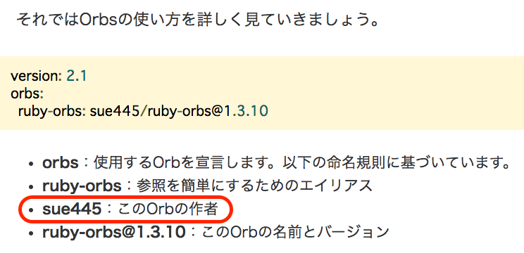
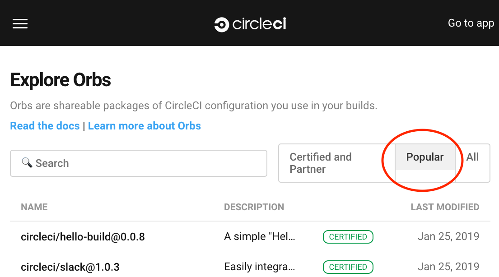
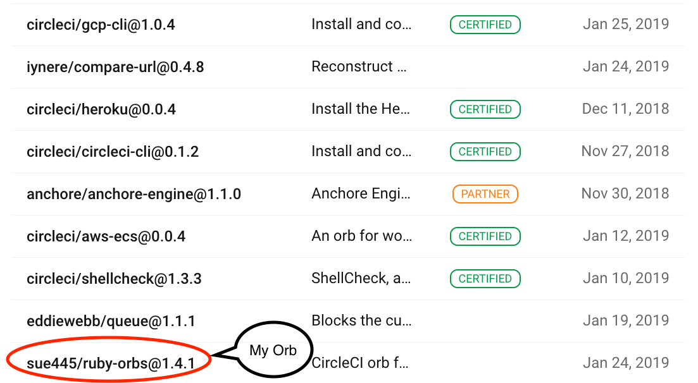
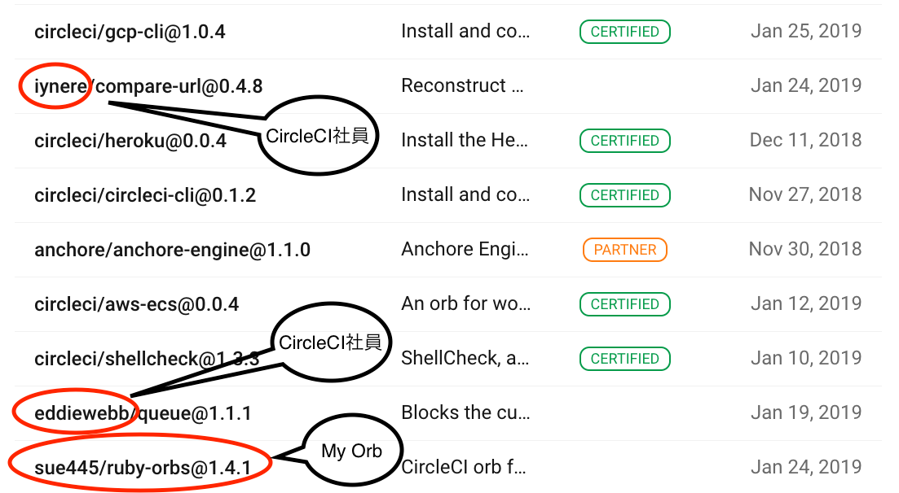
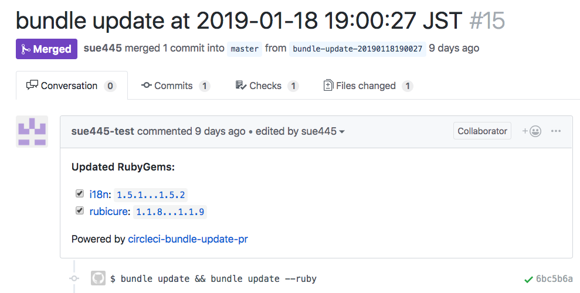
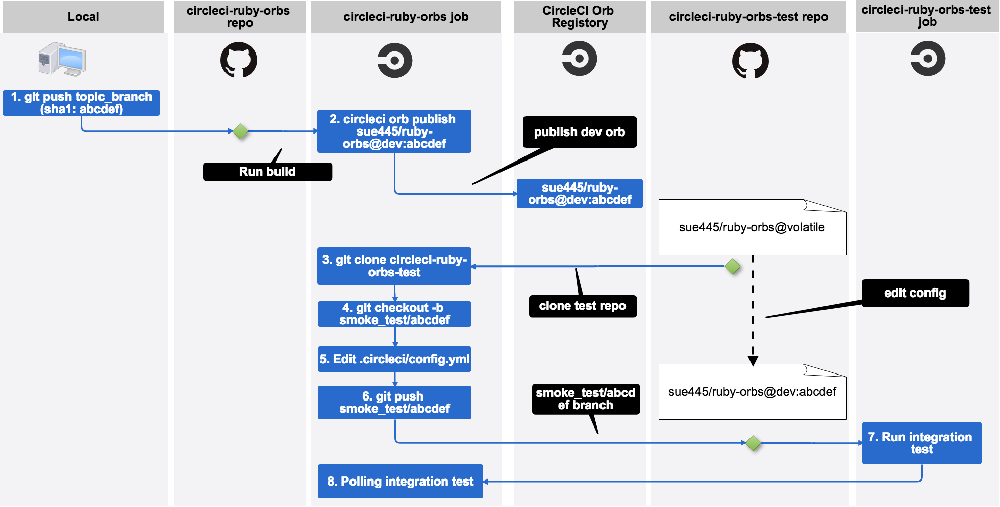

# Orbsベストプラクティス
sue445

2019/01/30 [第1回CircleCI ユーザーコミュニティイベント](https://circleci.connpass.com/event/115193/)

https://sue445.github.io/circleci-user-community-event-01/

---
## 自己紹介 [](https://twitter.com/sue445)

* Go Sueyoshi a.k.a [@sue445](https://twitter.com/sue445)
* ピクシブ所属
* 自称CIマニアでCircleCI, Wercker, Travis CI, GitLab CI, Jenkins辺りは3〜4年くらい利用してる
  * c.f. [CIマニアから見た各種CIツールの使い所 - くりにっき](https://sue445.hatenablog.com/entry/2018/12/07/114638)

---
### 【宣伝1】「このOrbの作者」の人です
https://codezine.jp/article/detail/11306?p=4



---
### 【宣伝2】最近 [Orbs registry](https://circleci.com/orbs/registry/) がPopular順でソートできるようになった


---
### 3rd party製Orbsの中では上から3番目


---
### CircleCIの社員を除けば実質1番 :muscle:


---
## 今日話すこと
* Orbsについて
* 自作Orbsの紹介
* Orbsのテストについて
* Orbsを作る時の勘所

---
## 最初にまとめ
* Orbsを活用することでリポジトリをまたいだ `.circleci/config.yml` のリファクタリングと処理の共通化が可能になる
* Orbsのテストは難しい

---
## Orbsとは
* `.circleci/config.yml` をモジュール化する仕組み
  * 複数リポジトリで共通する処理を1箇所に集約できる
  * 自分が作ったorbを配布もできる
* WerckerやGitLab CIにも似たような仕組はある

---
## CircleCIでアプリを作る時のあるある
* どのプログラミング言語を使うにしろ、ある程度の規模のアプリを作る時にはなんらかのライブラリをだいたい使う
  * 例）Rubyならgem, nodejsならnpm, Pythonならpip...
* 毎回ライブラリをフルでインストールすると時間がかかるのでCIではキャッシュ効かせてなるべくビルドの時間を短くしたい
  * CircleCIで実現しようとすると `restore_cache` -> 何らかのインストール処理 -> `save_cache` が定番

---
## CircleCI + Rubyあるある
* 「CircleCIのキャッシュを活かしつつ `bundle install` するstep」を書いている
* Ruby以外でもこういうのはよく書くと思う

```.circleci/config.yml
jobs:
  rspec:
    docker:
      - image: circleci/ruby

    steps:
      - checkout

      # 毎回フルでbundle installするとビルドが遅くなるのでキャッシュがあればとってくる
      - restore_cache:
          keys:
            - v1-bundle-{{ checksum "Gemfile.lock" }}
            - v1-bundle
      - run:
          name: bundle install
          command: |
            bundle install --jobs=4 --retry=3 --path vendor/bundle

            # 古いgemが残ってるとキャッシュが肥大化してビルドが遅くなるので消す
            bundle clean

            # Gemfile.lockに書かれてるbundlerのバージョンとCIのdockerイメージに入ってる
            # bundlerのバージョンに差異があるとGemfile.lockが更新されてchecksumが一致しなくなるので元に戻す
            gem install restore_bundled_with --no-document
            restore-bundled-with
      - save_cache:
          key: v1-bundle-{{ checksum "Gemfile.lock" }}
          paths:
            - ~/app/vendor/bundle
      # ↑↑↑↑↑↑ここから上は毎回同じ↑↑↑↑↑

      - run: bundle exec rake test
```

---
### つらみ
* さっきのはrspec（テスト）だけだけど、rspecとrubocop（静的解析）を並列実行したい時は同じようなのが必要
  * Rubyでアプリを作っていると `bundle install` の利用頻度は多い
* yamlのkeyで抽出してmergeすれば多少DRYにはなるが、リポジトリをまたがると無理なので同じのを何箇所も書く必要がある
* CircleCIだけで個人アプリ10個もメンテしてると全部にコピペが大量発生
* 個人アプリならそれなりに一貫性はあるのだが、社内リポジトリを見るとだいたいみんな同じことやってるんだけどアプリによって微妙に記述が違う
  * 参考にしたくてもデファクトがないのでどれを信用していいのか分からない

---
## 作ったもの：sue445/ruby-orbs
* https://circleci.com/orbs/registry/orb/sue445/ruby-orbs
* https://github.com/sue445/circleci-ruby-orbs
* Orbsが正式リリースされる1週間前くらいから作ってたんだけど、急にOrbsが正式リリースされたので急いで作りきった

---
### ruby-orbs/bundle-install
* さっきのくっそ長い処理が全部 `ruby-orbs/bundle-install` に集約されている
* 16行 -> 1行

```.circleci/config.yml
jobs:
  rspec:
    docker:
      - image: circleci/ruby

    steps:
      - checkout
      - ruby-orbs/bundle-install
      - run: bundle exec rspec
```

---
### ruby-orbs/bundle-update-pr
* https://github.com/masutaka/circleci-bundle-update-pr （CircleCIで自動 `bundle update` してPRを作るgem）をorb化したもの
  * `bundle update` = 自分のアプリで使ってるライブラリを全部最新にすること


---
#### 動作風景
* CircleCIのschedulerを利用して定期的に自動でライブラリを全部最新にするPRを作ってくれる
* [Dependabot](https://dependabot.com/) がSaaSで同じ機能を提供してる。（Ruby以外の他言語も対応してる）




---
#### Orb化するモチベーション
* 便利なんだけど、スニペット（gemを使うための準備）が結構長くて複数のリポジトリにコピペして回るのがつらい量なので、可能な限り隠蔽したかった

---
#### Before
https://github.com/masutaka/circleci-bundle-update-pr/blob/v1.14.1/README.md#configure-circleyml

```.circleci/config.yml
version: 2
jobs:
  build:
    # snip
  continuous_bundle_update:
    docker:
      - image: ruby:2.4.2-alpine
    working_directory: /work
    steps:
      - run:
          name: Install System Dependencies
          command: |
            # See also https://circleci.com/docs/2.0/custom-images/#adding-required-and-custom-tools-or-files
            apk add --update --no-cache git openssh-client tar gzip ca-certificates \
              tzdata
            gem install -N bundler
      - run:
          name: Set timezone to Asia/Tokyo
          command: cp /usr/share/zoneinfo/Asia/Tokyo /etc/localtime
      - checkout
      - restore_cache:
          name: Restore bundler cache
          keys:
            - gems-{{ .Environment.COMMON_CACHE_KEY }}-{{ checksum "Gemfile.lock" }}
            - gems-{{ .Environment.COMMON_CACHE_KEY }}-
      - run:
          name: Setup requirements for continuous bundle update
          command: gem install -N circleci-bundle-update-pr
      - deploy:
          name: Continuous bundle update
          command: circleci-bundle-update-pr <username> <email>

workflows:
  version: 2
  build:
    jobs:
      - build:
          # snip
  nightly:
    triggers:
      - schedule:
          cron: "00 10 * * 5"
          filters:
            branches:
              only: master
    jobs:
      - continuous_bundle_update
```

---
#### After
`jobs` が完全に不要で `workflows` だけになった

```.circleci/config.yml
version: 2.1
workflows:
  version: 2
  nightly:
    triggers:
      - schedule:
          cron: "00 10 * * 5"
          filters:
            branches:
              only: master
    jobs:
      - ruby-orbs/bundle-update-pr:
          image: "circleci/ruby:2.5.3"
          pre-bundle-update-pr:
            - run:
                name: "Set timezone to Asia/Tokyo"
                command: "sudo cp /usr/share/zoneinfo/Asia/Tokyo /etc/localtime"
            - ruby-orbs/bundle-install
```

---
## Orbsの仕組み
Orbsという外部のymlファイルを自分の`.circleci/config.yml`にincludeしてコンパイルして、インライン展開した新しい `.circleci/config,yml` を生成する

```yml
version: 2.1

orbs:
  # これがインライン展開される
  hello: namespace/orb@dev:0.0.1

workflows:
  hello-workflow:
    jobs:
      - hello/hello-build
```

---
### CircleCIが `.circleci/config.yml`をコンパイル
これが実際にCircleCIのジョブとして実行される

```yml
version: 2
jobs:
  # namespace/orbに定義されているhello/hello-buildがインライン展開された
  hello/hello-build:
    docker:
      - image: circleci/buildpack-deps:curl-browsers
    steps:
      - run:
          command: echo "Hello, build!"
workflows:
  hello-workflow:
    jobs:
      - hello/hello-build
  version: 2
```

---
## Orbsのテスト手法
c.f. [公式ドキュメント](https://github.com/CircleCI-Public/config-preview-sdk/blob/master/docs/orbs-testing.md)

1. Schema Validation
    * `config.yml` のシンタックスチェック
2. Expansion Testing
    * `config.yml` をコンパイルしてOrbsをインライン化するテスト
3. Runtime Testing
    * Orbsをpublishしないでコンテナ内でダミーのジョブを実行してテストを行う
4. Integration Testing
    * Orbsを実際にpublishして、テスト用のリポジトリで実際にそのOrbsを読み込ませてテストを行う

---
### 例）sue445/ruby-orbsのIntegration Testing
[](images/integration_testing.png)

c.f. https://sue445.hatenablog.com/entry/2018/11/16/125251

---
## Orbsを作る時の勘所 (1/2)
* シェルとCircleCIの機能を連携する部分がむいている
  * 例）「 `restore_cache` -> 言語ごとのインストール処理（Rubyなら `bundle install`） -> `save_cache` 」をひとまとめにする
* 複数のリポジトリで同じことを書いているならOrbs化チャンス

---
## Orbsを作る時の勘所 (2/2)
* Orbsそのものはテストしづらいので、Orbs側は既存機能の呼び出しに専念するのがいい
  * 前述の通り、Orbsを本気でテストしようとするとインテグレーションテスト用のリポジトリが必要になって大変
  * コアロジックはOrbsとは別で作った方がテストしやすいし、単体で使えるので汎用性が高くなる

---
## 合わせて読みたい
* 個人ブログにだいたい書いてます
  * https://sue445.hatenablog.com/archive/category/CircleCI

---
## まとめ
* Orbsを活用することでリポジトリをまたいだ `.circleci/config.yml` のリファクタリングと処理の共通化が可能になる
* Orbsのテストは難しい

---
## おまけ：CircleCIに対する要望
### [Registry] 特定のorgやuserが作ったorbの一覧が見れるページがほしい
* circleci公式のorb一覧や自分が作ったorbの一覧をまとめて見たい
* 例）https://hub.docker.com/u/sue445/ , https://rubygems.org/profiles/sue445

---
### [Registry] ソースコード（GitHubなど）へのリンクを貼る場所
* PRの送り先が分かりやすいと便利
* registoryには書けない詳細な使い方をGitHubに書く用途

---
### [Registry] どれだけ使われてるか客観的に分かる数字
* DockerHubで例えるとStarやPull数のようなもの
* 3rd party製のorbを探す時の選定材料としてあると便利
* Popular順でソートはできるのだが、何を基準にソートしてるのか分からないので合わせて表示してほしい

---
### [Testing] orbのテスト周りの手法がまとまってない
* 現状だと https://github.com/CircleCI-Public/orb-tools-orb のソースを読み解いて使い方を見つけるしかない
* https://github.com/CircleCI-Public/config-preview-sdk/blob/master/docs/orbs-testing.md をサンプルコードまで落とし込んだレベルが理想

---
### [Syntax] Conditional stepで簡単な演算子も書きたい
例

```yml
- when:
  - condition: << parameters.count == 3 >>
  - steps:
    - 〜
```


```yml
- when:
  - condition: << parameters.value == 'hoge' >>
  - steps:
    - 〜
```

---
### [Syntax] negation operator (`!`) がほしい
boolean型のparameterが `false` の時に実行されるブロックを書きたいができない

```yml
- run: |
    # こっちは書ける
    <<# parameters.with_gemfile_lock >>
    with_gemfile_lock="true"
    <</ parameters.with_gemfile_lock >>

    # こっちはエラー
    <<# !parameters.with_gemfile_lock >>
    with_gemfile_lock="false"
    <</ !parameters.with_gemfile_lock >>
```

---
#### Workaround (but dirty hack...)

```yml
- run: |
    with_gemfile_lock="false"
    <<# parameters.with_gemfile_lock >>
    with_gemfile_lock="true"
    <</ parameters.with_gemfile_lock >>
```
